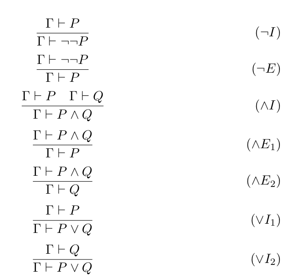
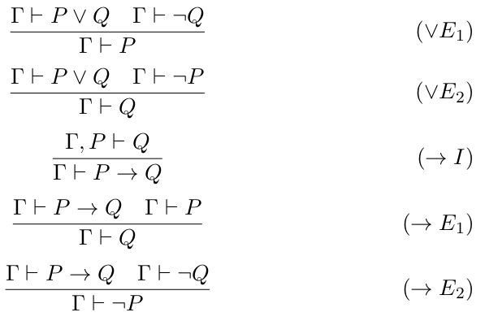
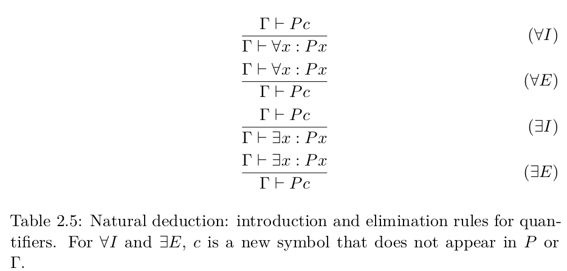
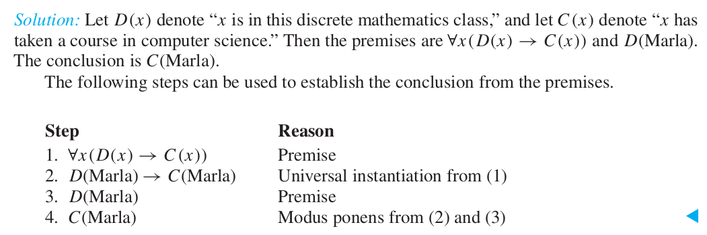
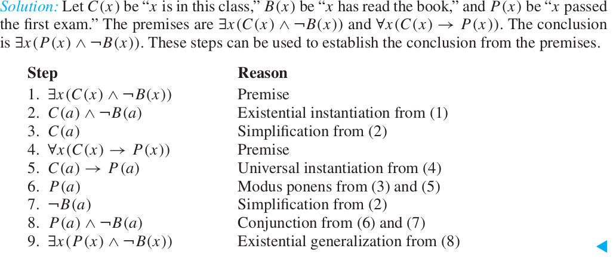

<style type="text/css">
div {
  font-size: clamp(11px, 3vw, 28px);
}
</style>

# Mathematical Logic 🧠  
*"Modeling reality with simplicity."*
- Proof Methods
  - Inference Rules
  - Proofs, implication, and natural deduction
- Proof Techniques

The content is mostly based on  [Notes  by James Aspnes](http://www.cs.yale.edu/homes/aspnes/classes/202/notes.pdf)


---

## Modeling Reality ↔️ Theory  
**Goal:** Simplify complex reality into mental models.  
- **Ideal Models:** Strip irrelevant details, keep essentials.  

| **Reality** 🌍 | → | **Model** 🧩 | → | **Theory** 📜 |  
|-----------------|---|--------------|---|----------------|  
| Piles of rocks 🪨 | → | `N = {0, 1, 2, ...}` | → | `∀x ∃y : y = x + 1` (Successor axiom) |  

**Big Models?** Use **axioms** and **inference rules** to build theories.  

---

## Axioms, Models, and Inference Rules ⚙️  

| Component | Description | Example 💡 |  
|-----------|-------------|-----------|  
| **Axioms** | Foundational truths | "All fish are green." 🐟 |  
| **Inference Rules** | Tools to derive truths | Modus Ponens: `P → Q, P ⊢ Q` |  
| **Theory** | All derivable statements | "George Washington is green!" 🎩 |  

---

# Proof Methods 🔍  
*Valid arguments to establish truth.*  

---

## Components of a Proof 🧩  
1. **Axioms/Theorems:**  
   - Always true in context.  
   - *Theorems* = Final results 🏁  
   - *Lemmas* = Intermediate results 🔄  
2. **Premises (P):** Assumptions for deriving consequences.  
3. **Inference Rules:** Derive conclusions (Q) from premises.  

---

**Game Analogy 🎮:**  
- **Start:** Axioms + Premises  
- **Rules:** Inference rules  
- **Goal:** Derive Q  

---

## Key Terms 📚  
| Term | Meaning |  
|------|---------|  
| **Hypothesis** | Unproven assumptions (axioms/premises) |  
| **Conclusion** | Final result derived from hypotheses |  

---

## Deducibility (`⊢`) vs. Implication (`→`) ⚖️  

| Symbol | Meaning | Example |  
|--------|---------|---------|  
| `P ⊢ Q` | Q is *provable* from P | "Given `P`, we can derive `Q` using rules." |  
| `P → Q` | Logical relationship | "If `P` is true, `Q` must be true." |  

### Soundness & Completeness 🎯  
- **Soundness:** If `P ⊢ Q`, then `P → Q` is a tautology. ✅  
- **Completeness:** If `P → Q` is a tautology, then `P ⊢ Q`. ✅  

---

## Inference Rules 🛠️  
*Tools to build valid arguments.*  

Inference rules let us construct **valid arguments**, which have the useful property that if their premises are true, their conclusions are also true.

---

## Inference Rules
Build valid arguments where true premises guarantee true conclusions.

**Modus Ponens** (Affirming):  
```
1. If P, then Q    [Axiom]
2. P              [Premise]
3. ∴ Q            [Modus Ponens]
```

---

### Modus Ponens 🎯  
**Tautology:** `(P ∧ (P → Q)) → Q`  
**Example:**  
1. *Axiom:* "If it doesn’t fit, you must acquit." 👨⚖️  
2. *Premise:* "It doesn’t fit." 🧥  
3. *Conclusion:* "You must acquit." ⚖️  

---

**Example**:  
*Premises*:  
- "If √2 > 3/2, then (√2)² > (3/2)²"  
- "√2 > 3/2"  
*Conclusion*: "2 > 9/4"  
*Validity*: Argument is valid (modus ponens), but premise is false.

---
### Validity of Arguments

**Determine the validity of the argument:**

"If $\sqrt{2} > \frac{3}{2}$, then $\sqrt{2}^2 > \left(\frac{3}{2}\right)^2$. We know that $\sqrt{2} > \frac{3}{2}$. Consequently, $\sqrt{2}^2 = 2 > \left(\frac{3}{2}\right)^2 = \frac{9}{4}$."

---

**Solution:**

- **Premise $p$:** $\sqrt{2} > \frac{3}{2}$
- **Premise $p \implies q$:** If $\sqrt{2} > \frac{3}{2}$, then $2 > \frac{9}{4}$.
- **Conclusion $q$:** The proposition $2 > \frac{9}{4}$.

The argument is **valid** because it is constructed using modus ponens.

---

**However:** $p$ is **false**, so the conclusion of the argument is false.

---

**Argument Validity Example** 🔢  
**Claim:**  
*"If √2 > 3/2, then (√2)² > (3/2)². Since √2 > 3/2, then 2 > 9/4."*  

| Component | Status |  
|-----------|--------|  
| **Premise P:** `√2 > 3/2` | ❌ False |  
| **Premise P→Q:** `√2 > 3/2 → 2 > 9/4` | ✅ True |  
| **Conclusion Q:** `2 > 9/4` | ❌ False |  

**Result:** Argument is **valid** (structure is sound) but **unsound** (P is false).  

---

 **Mouse & Cookie Argument**🐭🍪  
1. *Axiom 1:* "If you give a mouse a cookie, he’ll ask for milk." 🥛  
2. *Axiom 2:* "If he asks for milk, he’ll want a straw." 🥤  
3. *Premise:* "You gave a mouse a cookie." 🍪  
4. *Conclusion:* "He wants a straw." 🥤  

**Flaw:** Axiom 1 is false (mice can’t ask for milk). 🚫  

---

## Common Inference Rules 📜  

| Rule | Format | Example |
|------|--------|---------|
| **Modus Ponens** | `P, P→Q ⊢ Q` | "Rain → Wet, Rain ⊢ Wet" ☔ | 
| **Modus Tollens** | `¬Q, P→Q ⊢ ¬P` | "¬Wet, Rain→Wet ⊢ ¬Rain" 🌞 | 
| **Hypothetical Syllogism** | `P→Q, Q→R ⊢ P→R` | "Study→Pass, Pass→Happy ⊢ Study→Happy" 😊 | 
| **Disjunctive Syllogism** | `P∨Q, ¬P ⊢ Q` | "Pizza∨Salad, ¬Pizza ⊢ Salad" 🥗 | 
| **Resolution** | `P∨Q, ¬P∨R ⊢ Q∨R` | "Rain∨Snow, ¬Snow∨Traffic ⊢ Rain∨Traffic" 🚗 |

---


| Inference Rule                         |   Name              |                         |
|------------------------------|----------------------------------------|-----------------------------|
| $p \vdash p \lor q$          | **Addition**                              |                    |
| $p \land q \vdash p$         | **Simplification**                        |              |
| $p, q \vdash p \land q$      | **Conjunction**                           |                 |

---


**Example (example 6 from book):** Show that the premises
- “It is not sunny this afternoon and it is colder than yesterday,”
- “We will go swimming only if it is sunny,”
- “If we do not go swimming, then we will take a canoe trip,”
- and “If we take a canoe trip, then we will be home by sunset”  

lead to the **conclusion:** “We will be home by sunset.”

---

## Inference rules for equality

- The equality predicate allows **substitution**:
  $$
  x = y, P(x) \vdash P(y)
  $$

- Reflexivity of equality:
  $$
  \vdash x = x
  $$

---

### Inference rules for quantified statements


| **Rule**                     | **Representation**                  | **Example**                                                                 |
|------------------------------|--------------------------------------|-----------------------------------------------------------------------------|
| **Universal Instantiation**  | $\forall x P(x) \vdash P(c)$        | *Premise*: "All dogs bark."<br>*Conclusion*: "Fido (a specific dog) barks." |
| **Universal Generalization** | $P(c) \vdash \forall x P(x)$        | *Premise*: "For an arbitrary integer \( n \), \( n + 0 = n \)."<br>*Conclusion*: "For all integers \( x \), \( x + 0 = x \)." |
| **Existential Instantiation** | $\exists x P(x) \vdash P(c)$       | *Premise*: "Some student passed the exam."<br>*Conclusion*: "Let \( c \) be a specific student who passed." (where \( c \) is new) |
| **Existential Generalization** | $P(c) \vdash \exists x P(x)$      | *Premise*: "Alice solved the problem."<br>*Conclusion*: "There exists a person who solved the problem." |

---

### Notes:
1. **Universal Generalization**: The element \( c \) must be *arbitrary* (not a specific named instance).  
   Example: Proving "All squares have four sides" by assuming an arbitrary shape \( S \) is a square and showing \( S \) has four sides.

2. **Existential Instantiation**: The constant \( c \) must be *new* and not previously used in the proof.  
   Example: From "A planet has life," infer "Let \( c \) be such a planet."

3. **Existential Generalization**: Works for any specific instance.  
   Example: From "7 is prime," conclude "There exists a prime number."

---

## Proofs, Implication, and Natural Deduction

- $P \vdash Q$ means there is a proof of Q by applying inference rules to P.
  - Provability ($\vdash$) is outside the theory (it’s a statement about whether a proof exists or not).
- $P \implies Q$ says that Q holds whenever P does.
  - Implication ($\implies$) is inside (it’s a logical connective for making compound propositions).

---

**Relationship:**
Most of the time, $P \vdash Q$ and $P \implies Q$ mean almost the same thing.

For example:
- Suppose that $P \implies Q$ is provable without any assumptions:
  $$
  \vdash P \implies Q
  $$
- We can always ignore extra premises (add P):
  $$
  P \vdash P \implies Q
  $$
- By applying modus ponens:
  $$
  P \vdash Q
  $$
---

**Conclusion:**
This means we can go from $\vdash P \implies Q$ to $P \vdash Q$. Provability is, in a sense, weaker than implication.

But we usually don’t use this fact much, 
- P → Q is a much more useful statement than $P \vdash Q$.

---

### Deduction Theorem
A proof system typically shows
- Given some base assumptions $\Gamma$
- If certain premises $P_1, P_2, \dots, P_n$, hold, then some conclusion Q
holds

**Problem:**
If there is a proof of Q from premises $\Gamma, P_1, P_2, \dots, P_n$, then we want to rewrite it as:
$$
\Gamma \vdash (P_1 \land P_2 \land \dots \land P_n) \implies Q
$$

---

**Deduction Theorem:**
If there is a proof of Q from premises $\Gamma, P_1, P_2, \dots, P_n$, then there is a proof of $(P_1 \land P_2 \land \dots \land P_n) \implies Q$ from $\Gamma$ alone.


**Note:** In predicate logic, the deduction theorem only applies if none of the premises contain any free variables (variables that aren’t bound by a universal or existential quantifier).

---

### Natural Deduction: Introduction Rule for Implication
In practice, we usually don’t refer to the Deduction Theorem directly, and instead adopt a new inference rule (**→ I**)
$$
\frac{\Gamma, P \vdash Q}{\Gamma \vdash P \implies Q}
$$
This says that if we can prove Q using assumptions $\Gamma$ and $P$, then we can prove $P \implies Q$ using just $\Gamma$.

---

### Natural Deduction: Elimination Rule for Implication (Modus Ponens)
Corresponding elimination rule for eliminating implication **(modus ponens)**:
(**→ E**)
$$
\frac{\Gamma \vdash P \implies Q, \Gamma \vdash P}{\Gamma \vdash Q}
$$

---

### Natural Deduction: Introduction and Elimination Rules

|  |  |
|-------------------------|-----------------------|
|  |  |

For more, see [Natural Deduction on Wikipedia](https://en.wikipedia.org/wiki/Natural_deduction).

---


### Reminder: Inference Rules for Quantified Statements

| **Rule**                     | **Representation**                  |
|------------------------------|--------------------------------------|
| Universal Instantiation      | $\forall x P(x) \vdash P(c)$        |
| Universal Generalization     | $P(c) \vdash \forall x P(x)$        |
| Existential Instantiation    | $\exists x P(x) \vdash P(c)$        |
| Existential Generalization   | $P(c) \vdash \exists x P(x)$        |


---
### Natural deduction: Inroduction and Elimination Rules for Quantifiers



---

**example-12 from book:** Show that the premises “Everyone in this discrete mathematics class has taken a course in computer science” and “Marla is a student in this class” imply the conclusion “Marla has taken a course in computer science.”

---
**solution example 12**



---

**(example 13):** Show that the premises “A student in this class has not read the book,” and “Everyone in this class passed the first exam” imply the conclusion “Someone who passed the first exam has not read the book.”

---

**solution example 12**



---

### Inference Rules for Equality

The equality predicate allows the **substitution rule**:
$$
x = y, P(x) \vdash P(y)
$$

Alternatively, it can be written as an axiom:
$$
\forall x \forall y \left((x = y \land P(x)) \implies P(y)\right)
$$

We can also assert reflexivity directly:
$$
\vdash x = x
$$

---

# Proof Techniques

A proof technique is a template for how to go about proving particular classes of statements.

- This template guides you in the choice of inference rules (or other proof techniques) to write the actual proof.

---

## Direct Proof

### Template:
1. **Assume:** $A$
2. **Conclude:** $B$


**When to Use:** Try it first.

**What to do:** Apply inference rules to work forward from A and backward from B.

---

### Example:
Prove that if $n$ is an odd integer, then $n^2$ is odd.
- P(n) is “ $n$ is an odd integer”
- Q(n) is “ $n^2$ is odd.”
**Prove: ∀n P (n) → Q(n),**

---
We assume the hypothesis is true:
1. Assume $n$ is odd: $n = 2k + 1$ for some integer $k$.
2. Compute $n^2$:
   $$
   n^2 = (2k + 1)^2 = 4k^2 + 4k + 1 = 2(2k^2 + 2k) + 1
   $$
3. Since $n^2$ is one more than twice an integer, $n^2$ is odd.

---

## Proof by Contraposition ( a type of direct proof)

### Reminder:
For $p \implies q$, the contrapositive is $\neg q \implies \neg p$.

---

### Template:
1. **Assume:** $\neg B$
2. **Conclude:** $\neg A$

**When to use:** B = ¬Q
**What to do:** Apply any technique to show that ¬B → ¬A, and then apply contraposition rule.

---

### Example:
Prove that if $n = ab$, where $a$ and $b$ are positive integers, then $a \leq \sqrt{n}$ or $b \leq \sqrt{n}$.

1. **Assume** the conclusion is false (q is false, ¬q is true):
   $$
   \neg(a \leq \sqrt{n} \lor b \leq \sqrt{n}) \equiv a > \sqrt{n} \land b > \sqrt{n}
   $$
2. Then $ab > \sqrt{n} \cdot \sqrt{n} = n$, which contradicts $n = ab$.
   1. (p is false, ¬p is true)
3. Therefore, the contrapositive holds, and the original statement is true.

---


## Proof by Contradiction (a type of indirect proof)

### Template:
1. Assume the negation of the statement you want to prove.
2. Derive a contradiction.

**when to use:** when you are stuck trying the other techniques.

---

We want to prove statement `p` is true.
1. find a contradiction `q ≡ (r ∧ ¬r )` such that `¬p → (r ∧ ¬r)`:  
   1. If `q` is false and `¬p → q` is true (from assumption); 
   2. then `¬p` must be false.
1. or: `(p → q) ≡ (¬p ∨ q) ≡ ¬(p ∧ ¬q) ≡ (p ∧ ¬q) → ⊥`
- **Assume**: `p ∧ ¬q`
- **Conclude**: False

---

### Example:
Prove that $\sqrt{2}$ is irrational.

---

1. Assume $\sqrt{2}$ is rational: $\sqrt{2} = \frac{a}{b}$, where $a$ and $b$ are integers with no common factors.
2. Then $2b^2 = a^2$.
3. This implies $a$ is even, so $a = 2k$.
4. Substituting: $2b^2 = (2k)^2 = 4k^2$, so $b^2 = 2k^2$.
5. This implies $b$ is even, contradicting the assumption that $a$ and $b$ have no common factors.

---

## Proofs of Equivalence

To prove $p \iff q$, show that $p \implies q$ and $q \implies p$ are both true.

**Based on Tautology:**
$$
(p \iff q) \iff (p \implies q) \land (q \implies p)
$$


---

## Counterexamples

To **disprove** a statement of the form $\forall x P(x)$, find a counterexample $c$ such that $\neg P(c)$ is true.

---

### Example:
**Disprove**: "Every positive integer is the sum of the squares of two integers."

- For $c = 3$, the perfect squares less than 3 are $0^2 = 0$ and $1^2 = 1$.
- There is no way to write $3$ as the sum of two squares.

---


## Proof by Cases and Exhaustive Proof
**Approach**: Split into cases covering all possibilities.
To prove: `(p1 ∨ p2 ∨ · · · ∨ pn ) → q`

Use the tautology 
$$((p_1 \lor p_2 \lor \dots \lor p_n) \to q) 
\iff ((p_1 \to q) \land (p_2 \to q) \land \dots \land (p_n \to q))$$

then prove each $(p_i \to q)$, individually. (proof by cases)


---

**Example**:  
*Theorem*: ∀n∈ℤ (n² ≥ n).  
*Cases*:  
1. n = 0 → 0 ≥ 0 ✔️  
2. n ≥ 1 → n² ≥ n ✔️  
3. n ≤ -1 → n² ≥ n ✔️  

---

**Exhaustive Proof:**

Some theorems can be proved by examining a relatively small number of examples. These proofs proceed by exhausting all possibilities.

**example:** Prove that $(n + 1)^3 \geq 3n$ if $n$ is a positive integer with $n \leq 4$.
- verify inequality for n = 1, 2, 3, 4

---

## Uniqueness Proofs
1. **Existence**: Find element x with property P(x).
2. **Uniqueness**: Show y ≠ x ⇒ ¬P(y).

**Remark:** Showing that there is a unique element x such that P(x) is the same as proving the statement 
`∃x (P(x) ∧ ∀y(y ≠ x → ¬P(y)))`

---
**Example**:  

*Theorem*: If a ≠ 0, ax + b = 0 has unique solution.  
*Proof*:  
- *Existence*: x = r = -b/a works.  
- *Uniqueness*: For real s,  if as + b = 0 and ar + b = 0 ⇒ r = s.
  - This means if s ≠ r , then as + b ≠ 0.

---

**Example**
Show that there is a positive integer that can be written as the sum of cubes of positive integers in two different ways.

**Solution with exhaustive search:** 1729=103 +93 =123 +13.
**A Constructive Existence Proof** Just find an $a$ such taht $P(a)$ is true

---

**Example**
Show that there exist irrational numbers x and y such that xy is rational.

**Solution:** We know that $\sqrt{2}$ is irrational.
- $\sqrt{2}^{\sqrt{2}}$ 
  - if it is rational, we find x, y that gives rational.
  - if not choose x = $\sqrt{2}^{\sqrt{2}}$ and y = $\sqrt{2}$
    - $x^y = 2$ which is rational.

**A Nonconstructive Existence Proof:** We proved it is true in someway or another.

---

**Example**

Show that there are no solutions in integers x and y of $x^2 + 3y^2 = 8$.

**Solution**
Find cases from when $x^2 > 8$ and so on.
- this gives x = −2,−1,0,1, or 2 and y equals −1, 0, or 1.

**without loss of generality** If some of the cases are the same, you do not repeat the trivial cases. 

---

**Common pitfalls in exhaustive proofs**

- draw incorrect conclusions from examples.
- unwarranted assumptions that eliminates some cases.

**Example:** If $x$ is a real number, then $x^2$ is a positive real number.
- ❌ not considering $x=0 \to x^2=0$ case in the proof.

---

**Example 15 from book:** prove that 1 = 2?  
**"proof":**
What is wrong in these steps?
1. a = b (Given)
2. $a^2 = ab$ (Multiply  by a)
3. $a^2 −b^2 =ab−b^2$ (Subtract $b^2$)
4. $(a−b)(a+b)=b(a−b)$ (Factor)
5. $a+b=b$ (Divide  by a − b)
6. $2b = b$ (Replace a by b because a = b)
7. $2=1$ (Divide  by b)

❌ (a-b) is 0. Divisipn by 0.

---

**Example 16:** If $n^2$ is positive, then $n$ is positive.  
What is wrong in the **proof**?  
Suppose that $n^2$ is positive.   
- Because “If $n$ is positive, then $n^2$ is positive” is true, 
- we can conclude that n is positive.

❌ ∀n(P(n) → Q(n)) we cannot conclude P(n) from Q(n).

---

**Example 18:** show that $n$ is an even integer whenever $n^2$ is an even integer.

**Proof:** Suppose that $n^2$ is even. 
- Then $n^2 = 2k$ for some integer k. 
- Let $n = 2l$ for some integer $l$. This shows that $n$ is even.

❌ **Circular reasoning:**
No argument has been given to show that $n$ can be written as $2l$ for some integer $l$. This is also in the proof.

---

# Appendix

## Key Symbols
- ⊢ (Turnstile): "Derives" or "Proves"
- ∀ (Universal Quantifier): "For all"
- ∃ (Existential Quantifier): "There exists"


**Final Thought:**  
*“Logic is the backbone of truth—build your arguments wisely!”* 🏗️✨  

--- 
